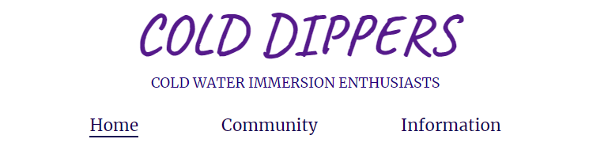

# Cold Dippers

Cold Dippers is a website for a Brighton based cold water immersion community. The purpose of the website is to bring like mided people together who want to reap the benifits of exposure to the cold. It is there to provide support and information to anyone who may be interested. 

## Features

### Existing Features

- #### Logo and Navigation Menu
    - The Cold Dippers logo and the three different pages available are displayed on the top of each page in the exact same way on each page for easy navigation.
    - A small description of who the Cold Dippers are is displayed under the logo.
    - Clicking the logo will bring you back to the homepage from any of the three pages.
    -The current page you are on will have the page name underlined in the navigation menu.

- #### Homepage Image and Description
    - The first thing on the homepage is a picture of the Brighton sea with a community description to let the user know what the aim of the website is.
    - The image is made with a parallax scrolling effect to give the sense that it is a window looking out to Brighton sea to draw in the user.

- #### Homepage Information
    - The homepage information starts of with a few questions to see if this communiity is something new potential members may be interested in.
    - The homepage then goes on to a section where some information about the benefits of this practice is given. 
    - Some motivaional words are presented through this section to help encourage people to join.
    - At the very bottom of the hompage you will find logos of different social media platforms that each link to the specified social platform for the Cold Dippers community. These logos and links can be found at the bottom of each page within the website.

- #### Community Images and Values
    - At the top of the community page there are some images displayed of the Brighton sea and members taking part in the cold water swimming. 
    - A Set of values is displayed labeled and displayed under the community images to let the users know what the values the community likes to promnote and finds most important.

- #### Get In Touch Form
    - At the bottom of the community page a 'Get in touch' form can be found that lets users type in their e-mail, message, reason for contact and check a box if they would like to recive a weekly newsletter from the community.
    - A group picture of the Cold Dippers community is located next to the form in order to provide some sense of who they are contacting. 
    - The send button has a hover effect turning it a different color.

- #### Times, Location and Important Informatiuon
    - At the top of the information page the meet up days and times can be found.
    - A map is embeded next to meet-up times with the meet-up location pin pointed.
    - Additional important information can be found next to the map and how to find extra information on social platforms incase of unforseen events.

- #### About Us
    - The bottom of the information page contains a more detailed description about the origins of the community and the goals it aims to achieve.

- #### Additional Features
    - All links within the webpage will open in new tabs for easy navigation.
    - All links within normal text are blue and underlined for easy identification that they are links.
    - A blue gradient effect has been added to the background of all pages to give off the sense that you are submerging into cold water as you scroll down.
    - Certain words and phrases have been accentuated with color change, being made bold or made italicised where emphasis is deemed important.

### Features Left to Implement
 - The community values on the information page, when each value is clicked a box or a link to another page will open describing each value more in detail and how the community works to keep them up.
 - A contact page will be added where all relevant contact information will be collected including the get in touch from from the community page.
 - A log in function will be added for 
 - On the community page a discussion board will be added where members can 